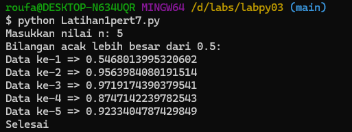
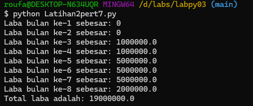
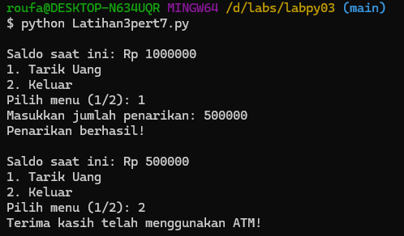

# labpy03

- Nama : Roufan Awaluna Romadhon
- NIM : 31210423
- Kelas : TI.24.A.3

---

## Deskripsi
Repository ini berisi satu program Python (`labpy03.py`) yang terdiri dari tiga latihan:
1. **Latihan 1** - Menampilkan Bilangan Acak yang Lebih dari 0.5
2. **Latihan 2** - Menghitung Laba Investasi
3. **Latihan 3** - Simulasi ATM Sederhana

Program ini dibuat untuk membantu mempelajari konsep-konsep dasar pemrograman seperti perulangan, kondisi, dan operasi matematika.

---

## 1. Latihan 1: Bilangan Acak

### Deskripsi Program:
Program ini menampilkan `n` bilangan acak yang lebih besar dari 0.5. Pengguna memasukkan jumlah bilangan (`n`), dan program hanya akan menampilkan bilangan yang lebih besar dari 0.5.

### Kode Program
Kode program dapat dilihat dibawah ini atau buka file ini [`Latihan1pert7.py`](Latihan1pert7.py).
```python
from random import random

# Memaskkan jumlah angka yang mau dihasilkan
n = int(input("Masukkan nilai n: "))

# Menampilkan n bilangan acak yang lebih besar dari 0.5
print("Bilangan acak lebih besar dari 0.5:")
count = 1
while count <= n:
    number = random()
    if number > 0.5:
        print(f"Data ke-{count} => {number}")
        count += 1

print("Selesai")
```

### Penjelasan Program:
1. Pengguna diminta memasukkan nilai `n`, yaitu jumlah bilangan acak yang ingin ditampilkan.
2. Menggunakan perulangan `while`, program menghasilkan bilangan acak menggunakan fungsi `random()`.
3. Program memeriksa apakah bilangan yang dihasilkan lebih besar dari 0.5.
4. Jika bilangan memenuhi kriteria, program menampilkannya dan mengurangi jumlah bilangan yang masih harus ditampilkan.
5. Program selesai setelah menampilkan `n` bilangan yang memenuhi kriteria.

### Screenshot Hasil Eksekusi Program:
Berikut adalah hasil eksekusi programnya:



---

## 2. Latihan 2: Laba Investasi

### Deskripsi Program:
Program ini menghitung total laba investasi selama 8 bulan dengan kondisi laba yang berubah-ubah. Modal awal adalah Rp100.000.000, dan laba dihitung berdasarkan persentase yang berbeda di setiap bulan tertentu.

### Kode Program
Kode program dapat dilihat dibawah ini atau buka file ini [`Latihan2pert7.py`](Latihan2pert7.py).
```python
# Modal awal
modal = 100000000  # 100 juta
total_laba = 0

# Hitung laba bulanan
for bulan in range(1, 9):
    if bulan == 1 or bulan == 2:
        laba = 0
    elif bulan == 3 or bulan == 4:
        laba = modal * 0.01
    elif bulan == 5 or bulan == 6 or bulan == 7:
        laba = modal * 0.05
    elif bulan == 8:
        laba = modal * 0.02
    else:
        laba = 0
    
    print(f"Laba bulan ke-{bulan} sebesar: {laba}")
    total_laba += laba

print(f"Total laba adalah: {total_laba}")
```

### Penjelasan Program:
1. Modal awal ditetapkan sebesar Rp100.000.000.
2. Laba dihitung selama 8 bulan:
   - Bulan 1 dan 2: Tidak ada laba (0%).
   - Bulan 3 dan 4: Laba 1% dari modal.
   - Bulan 5 hingga 7: Laba 5% dari modal.
   - Bulan 8: Laba 3% dari modal.
3. Program menghitung dan menampilkan laba setiap bulan, kemudian menambahkan laba bulanan ke total laba.
4. Program menampilkan total laba setelah 8 bulan.

### Screenshot Hasil Eksekusi Program:
Berikut adalah hasil eksekusi programnya:



---

## 3. Latihan 3: Simulasi ATM

### Deskripsi Program:
Program ini mensimulasikan ATM sederhana. Pengguna memiliki saldo awal sebesar Rp1.000.000, dan dapat melakukan penarikan uang hingga saldo habis atau memilih untuk keluar.

### Kode Program
Kode program dapat dilihat dibawah ini atau buka file ini [`Latihan3pert7.py`](Latihan3pert7.py).
```python
# Saldo awal
saldo = 1000000  # Rp 1.000.000

# Loop menu ATM
while True:
    print(f"\nSaldo saat ini: Rp {saldo}")
    print("1. Tarik Uang")
    print("2. Keluar")
    pilihan = input("Pilih menu (1/2): ")
    
    if pilihan == "1":
        jumlah = int(input("Masukkan jumlah penarikan: "))
        
        if jumlah > saldo:
            print("Saldo tidak mencukupi!")
        else:
            saldo -= jumlah
            print("Penarikan berhasil!")
            
    elif pilihan == "2":
        print("Terima kasih telah menggunakan ATM!")
        break
    else:
        print("Pilihan tidak valid, silakan pilih lagi.")
```

### Penjelasan Program:
1. Program memulai dengan saldo awal sebesar Rp1.000.000.
2. Program menampilkan menu:
   - Pilihan 1 untuk penarikan uang.
   - Pilihan 2 untuk keluar dari program.
3. Jika pengguna memilih untuk menarik uang, program meminta jumlah penarikan dan memeriksa apakah saldo mencukupi.
   - Jika saldo mencukupi, program mengurangi saldo dan menampilkan pesan keberhasilan.
   - Jika saldo tidak cukup, program menampilkan pesan kesalahan.
4. Jika pengguna memilih untuk keluar, program menampilkan pesan terima kasih dan berhenti.

### Screenshot Hasil Eksekusi Program:
Berikut adalah hasil eksekusi programnya:




